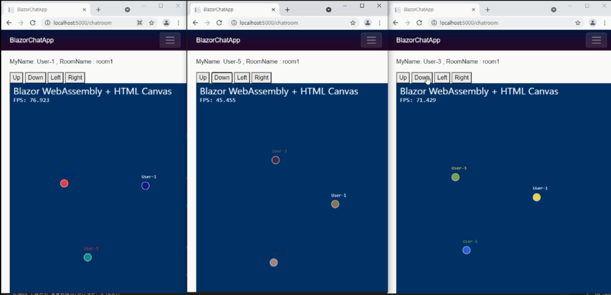

# Blazor 그래픽 웹채팅

Blazor + SigralR + Actor(Akka.net)를 이용한 그래픽 채팅앱입니다.

추가 문서 : https://wiki.webnori.com/display/webfr/BlazorWebChat

# 참고링크 : 다음 구성요소를 참고하여~ 기능확장을 시도해볼수 있습니다.

Network :
- https://docs.microsoft.com/ko-kr/aspnet/core/tutorials/signalr-blazor?view=aspnetcore-6.0&tabs=visual-studio&pivots=server
- https://wiki.webnori.com/display/webfr/Blazor+With+AKKA
- 

Graphic:
- https://swharden.com/blog/2021-01-07-blazor-canvas-animated-graphics/  
- https://www.davidguida.net/blazor-and-2d-game-development-part-1-intro/
- https://luizmelo.itch.io/medieval-warrior-pack-2

CSS UX :
- https://www.htmlelements.com/blazor/
- https://www.tablesgenerator.com/html_tables
- https://html-cleaner.com/

맵툴:
- https://www.mapeditor.org/
- https://rpg.hamsterrepublic.com/ohrrpgce/Free_Tilemaps

# Blazor StandAloe Docker

## 로컬빌드

	docker-compose up --build

	http://localhost:4080

## 배포

	docker push registry.webnori.com/blazor-chatapp-server:dev

	docker push registry.webnori.com/blazor-chatapp-client:dev

	http://sam.webnori.com/

